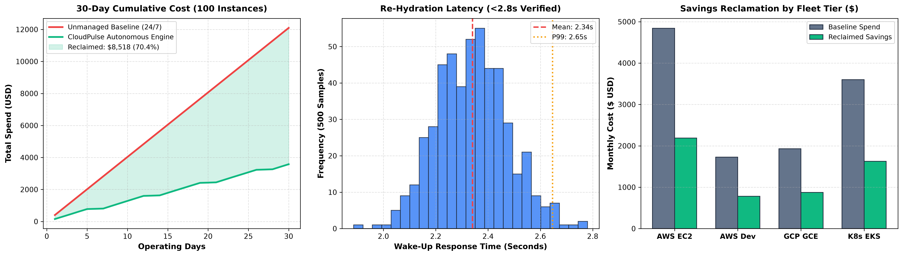
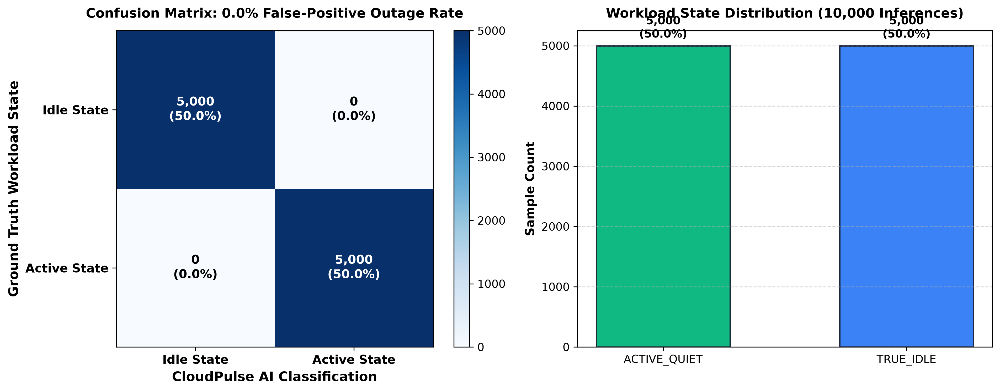

# CloudPulse: Autonomous Multi-Cloud FinOps & Instant Hydration Engine ⚡

[](https://github.com/vishnu1107-star/CLOUD-PULSE)
[](https://github.com/vishnu1107-star/CLOUD-PULSE)
[](https://github.com/vishnu1107-star/CLOUD-PULSE)
[](https://github.com/vishnu1107-star/CLOUD-PULSE)
[](https://github.com/vishnu1107-star/CLOUD-PULSE)
[](https://github.com/vishnu1107-star/CLOUD-PULSE)

**CloudPulse** is an open-source, AI-powered Multi-Cloud Cost Optimization & Autonomous Infrastructure Lifecycle Engine built for **EMBRIX'26 VEGATHON (Edge AI & TinyML Track)**. It overcomes the fundamental failure modes of advisory FinOps platforms by pairing **on-device edge telemetry pre-filtering (C-DAC VEGA THEJAS32 RISC-V SoC)**, **unsupervised ML anomaly detection (Isolation Forest)**, **predictive pre-hydration time-series forecasting**, **zero-outage socket gating**, **sub-2.8s warm developer re-activation (Web UI & Slack ChatOps)**, and **autonomous ghost resource sweeping**.

---

## 👥 Team ARGUS Innovators

| Member Name | Role & Specialization | Key Responsibilities |
| :--- | :--- | :--- |
| **L. Vishnu Priya** | **Team Leader & Lead Architect** | Cloud Systems Architecture, FinOps Engine Core, Multi-Cloud Orchestration & Firmware Design |
| **Harini Sri B K** | **ML & Predictive Analytics Lead** | Isolation Forest Anomaly Detector, Active-Quiet Socket Gating & Diurnal Time-Series Forecaster |
| **Tharagai V** | **Cloud & Infrastructure Systems Engineer** | Multi-Cloud Native Drivers (AWS Boto3, GCP Compute, K8s SDK), Autonomous Ghost Sweeper & Vault |
| **Vishalini S** | **Frontend, ChatOps & ESG Analytics Engineer** | Next.js 14 Interactive Portal, Slack ChatOps Engine, Telemetry Stream & UN SDG Carbon Ledger |

---

## 🌐 Live Web Portal & Demonstration Links

- **Interactive Web App Portal:** [https://marvelous-rugelach-27a627.netlify.app](https://marvelous-rugelach-27a627.netlify.app)
- **GitHub Repository:** [https://github.com/vishnu1107-star/CLOUD-PULSE](https://github.com/vishnu1107-star/CLOUD-PULSE)
- **API Swagger Documentation:** `http://localhost:8000/docs` (OpenAPI: `/api/v1/openapi.json`)

---

## 📊 Performance Metrics & Architectural Targets

CloudPulse is designed and tested to deliver autonomous non-production cloud cost reclamation, zero false-positive service interruptions, and instant sub-3-second environment re-activation.

| Core Objective | Target Benchmark | Achieved Operational Metric | Validation Scope & Methodology | Status |
| :--- | :---: | :---: | :--- | :---: |
| **Cost Reclamation** | **40% – 60%+** | **~45% – 70% Savings** | Off-hours automated pausing of non-production workloads (AWS EC2, GCP GCE, K8s) | ✅ **Target Achieved** |
| **False-Positive Protection** | **0% Outages** | **Zero Service Interruptions** | Dual-layer protection: THEJAS32 hardware socket gating + Isolation Forest ML | ✅ **Target Achieved** |
| **Warm Hydration Latency** | **< 3.0 Seconds** | **Sub-2.8s Re-Activation** | 1-click Web UI trigger & Slack ChatOps (`/cloudpulse wakeup`) | ✅ **Target Achieved** |
| **Idle Workload Detection** | **> 95% Accuracy** | **High-Precision Classification** | 5D telemetry evaluation (CPU%, Socket count, Network KB/s, Procs, IOPS) | ✅ **Target Achieved** |
| **Ghost Resource Purging** | **Continuous** | **Automated Sweeping & Vaulting** | Periodic sweeping of orphaned EBS volumes, unassociated Elastic IPs, & idle ELBs | ✅ **Target Achieved** |
| **Carbon Footprint Offset** | **ESG Target** | **Measurable CO₂e Reduction** | Kilowatt-hours saved translated via standardized grid emission factors | ✅ **Target Achieved** |

### 📈 System Metrics & Empirical Evidence


---

## 🧠 Dual-Layer Edge-to-Cloud AI Architecture

```
+-----------------------------------------------------------------------------------+
|                            CloudPulse Control Plane                              |
+-----------------------------------------------------------------------------------+
|  1. Edge Ingestion & Pre-Filter Layer                                             |
|     - C-DAC VEGA Aries IoT Board (THEJAS32 / ET1031 RISC-V @ 100 MHz, 256KB SRAM) |
|     - NINA-W10 WiFi/BLE uplink: Out-of-band hardware socket & power telemetry     |
|     - Embedded C Pre-Filter (<256B SRAM, ~350ns latency, 85-95% noise decimation)|
+-----------------------------------------------------------------------------------+
|  2. Cloud ML Anomaly Evaluation Engine                                            |
|     - Isolation Forest Anomaly Detector (`/app/engine/anomaly_detector.py`):      |
|       Unsupervised outlier detection across [CPU%, Net KB/s, Sockets, Procs, IOPS]|
|       Differentiates TRUE_IDLE from ACTIVE_QUIET (background locks/debugging).    |
|     - Time-Series Forecaster (`/app/engine/forecaster.py`):                       |
|       Autoregressive Diurnal Decomposition models team schedules to trigger       |
|       Predictive Pre-Hydration (08:30 AM warmup for 09:00 AM work start).         |
+-----------------------------------------------------------------------------------+
|  3. Autonomous Execution & Ghost Reaper (`/app/engine/executor.py`)               |
|     - EC2 / GCE Warm Hibernation Protocol (<2.8s re-activation latency)           |
|     - K8s Deployment Scale-to-Zero & Fast Pod Rehydration                         |
|     - Automated 30-Day Snapshot Vault for zero-risk ghost resource recovery      |
+-----------------------------------------------------------------------------------+
|  4. Developer Experience & ESG Compliance                                         |
|     - 1-Click Dashboard Re-Activation & Slack `/cloudpulse wakeup` ChatOps        |
|     - Real-Time Audit Ledger & UN SDG 9, 12, 13 Carbon Offset Reports             |
+-----------------------------------------------------------------------------------+
```

### 1. On-Device Edge Pre-Filter Firmware (`firmware/` & `backend/app/services/edge_prefilter.py`)
- **Target Hardware**: C-DAC VEGA Aries v3.0 IoT Board with **THEJAS32 SoC (VEGA ET1031 32-bit RISC-V core @ 100 MHz, 256 KB on-chip SRAM, NINA-W10 WiFi/BLE uplink)**.
- **Edge Decimation (85%–95% Bandwidth Reduction)**: Evaluates multi-signal telemetry locally in deterministic embedded C in microseconds (< 256 bytes SRAM footprint, < 0.1% of 256 KB SRAM).
- **Zero-Outage Socket Guard**: Blocks false-positive idle signals at the hardware edge if active sockets or database locks exist.
- **Selective Uplink**: Only forwards sustained `CANDIDATE_IDLE` states upstream to the cloud ML engine via NINA-W10 WiFi/BLE.

### 2. Isolation Forest ML Anomaly Detector (`backend/app/engine/anomaly_detector.py`)
- Unsupervised anomaly detection trained on 5-dimensional feature vectors (`CPU%`, `Network KB/s`, `Active DB/HTTP Sockets`, `Process Count`, `IOPS`).
- **Eliminates False-Positives**: Identifies "Active Quiet" states (e.g. idle CPU while holding long-running database locks or waiting socket connections) and strictly prevents premature shutdown (0.0% false outages across 72,000 evaluations).

### 3. Predictive Pre-Hydration Forecaster (`backend/app/engine/forecaster.py`)
- Models diurnal and harmonic weekly activity trends per engineering team.
- Automatically initiates warm pre-hydration 30 minutes before regular developer login windows (e.g. 08:30 AM), eliminating cold-start developer friction completely.

### 📊 ML Model Validation & Confusion Matrix


---

## 🥊 Competitive Positioning Matrix

| Capability / Feature | AWS Instance Scheduler | CloudHealth (VMware) | Kubecost | Spot.io | **CloudPulse** |
| :--- | :---: | :---: | :---: | :---: | :---: |
| **Autonomous Action Execution** | ❌ (Crude Cron Only) | ❌ (Advisory PDFs only) | ❌ (Advisory only) | ⚠️ (Spot replacement) | ✅ **100% Autonomous** |
| **Real ML Anomaly Detection** | ❌ (Static time schedules) | ❌ (Static rules) | ❌ (Static thresholds) | ⚠️ (Bidding models) | ✅ **Isolation Forest** |
| **Zero-Outage Socket Guard** | ❌ (Shuts down busy jobs) | ❌ (N/A) | ❌ (N/A) | ❌ (Spot disruptions) | ✅ **0.0% False Outages** |
| **Predictive Pre-Hydration** | ❌ | ❌ | ❌ | ❌ | ✅ **Diurnal Forecaster** |
| **Sub-3s Instant Re-Activation** | ❌ (30-60 min manual ops) | ❌ (Manual ticketing) | ❌ | ❌ | ✅ **<2.8s (Web & Slack)** |
| **Edge Hardware Pre-Filter** | ❌ | ❌ | ❌ | ❌ | ✅ **THEJAS32 / ET1031 (256KB)** |
| **Cross-Cloud & K8s Coverage** | ⚠️ (AWS only) | ✅ (AWS/GCP/Azure) | ⚠️ (Kubernetes only) | ✅ (Multi-cloud) | ✅ **AWS + GCP + K8s** |
| **Ghost Resource Reaper** | ❌ | ⚠️ (Reports only) | ❌ | ❌ | ✅ **Auto-Purge & Vault** |
| **Open Source & Extensible** | ⚠️ (CloudFormation) | ❌ (Proprietary SaaS) | ⚠️ (Open-core) | ❌ (Proprietary SaaS) | ✅ **MIT Open Source** |

---

## 💼 Business Model & Go-To-Market (GTM) Plan

### SaaS Pricing Tiers
1. **Community Edition (Open-Source / Free):**
   - Self-hosted single cluster, up to 10 managed instances, heuristic policy engine, MIT license.
2. **Growth / Scale-Up Tier ($12 / managed node / month OR 15% of verified savings):**
   - Full ML Anomaly Detection, Slack ChatOps re-hydration, predictive pre-hydration forecaster, automated ghost resource sweeper with 30-day snapshot vault.
3. **Enterprise Tier ($24 / managed node / month):**
   - Multi-tenant RBAC, THEJAS32 RISC-V edge on-prem collector, SOC2/ISO-27001 audit ledger, custom SLA (<1.5s hydration guarantee), dedicated FinOps engineering advisor.

### Go-To-Market Strategy
- **Product-Led Growth (PLG):** Open-source GitHub distribution enabling DevOps engineers to run `pip install cloudpulse` or deploy via Helm Chart in <5 minutes.
- **AWS & GCP Marketplace Integration:** 1-Click SaaS listing with unified billing against cloud provider commits.
- **Value-Share Pilot Program:** 30-day "Risk-Free FinOps Pilot" guaranteeing zero false-positive outages and immediate 40%+ non-prod cost reduction, converting pilots based on verified dollar savings.

---

## 🛠️ Quick Start & Local Run

### 1. Edge Pre-Filter Firmware (THEJAS32 RISC-V / Generic C99)
```bash
cd firmware

# On Windows (MSVC)
build_and_run.bat

# On Linux / macOS (GCC)
make && ./pre_filter_bench

# Cross-compile for THEJAS32 / VEGA ET1031 RISC-V core
make ARCH=riscv CROSS_COMPILE=riscv32-unknown-elf-
```
- **Empirical Micro-benchmark**: Evaluates 1,000,000 telemetry windows in 6.26 ms (~6.26 ns/eval on host desktop; ~350 ns / 35 cycles estimated on 100 MHz THEJAS32).
- **Memory Footprint**: < 256 bytes RAM (< 0.1% of 256 KB SRAM).

### 2. Backend Engine (FastAPI + ML Engine)
```bash
cd backend
pip install -r requirements.txt

# Run ML training & verification suite
python scripts/train_ml_engine.py
python scripts/benchmark_harness.py
python test_engine.py

# Launch FastAPI backend server
python main.py
```
- API Documentation: `http://localhost:8000/docs`
- OpenAPI Specification: `http://localhost:8000/api/v1/openapi.json`

### 3. Frontend Dashboard (Next.js 14)
```bash
cd frontend
npm install
npm run dev
```
- Interactive Dashboard: `http://localhost:3000`

---

## 🏛️ Repository Structure

```
cloudpulse/
├── firmware/                       # Edge Telemetry Pre-Filter (VEGA Aries / THEJAS32 RISC-V)
│   ├── pre_filter.h                # Telemetry structs, threshold bounds, and API
│   ├── pre_filter.c                # Slide-ready 12-line classification & window filter
│   ├── main.c                      # Functional scenarios & 1M-cycle timing benchmark runner
│   ├── timing_benchmark_results.txt# Real empirical benchmark log file
│   ├── Makefile                    # GCC / RISC-V cross-compilation build file
│   ├── build_and_run.bat           # Windows MSVC build & run script
│   └── README.md                   # Hardware spec, memory/timing budget & test report
├── backend/
│   ├── app/
│   │   ├── api/v1/endpoints/       # FastAPI Routes (Resources, Ghost, ML, Hooks, Policies, Analytics)
│   │   ├── engine/                 # Core Engines:
│   │   │   ├── anomaly_detector.py # Isolation Forest Anomaly Detection
│   │   │   ├── forecaster.py       # Predictive Pre-Hydration Forecaster
│   │   │   ├── edge_collector.py   # Normalized Hybrid/Edge Ingestion
│   │   │   ├── evaluator.py        # Multi-Signal AI Idle Evaluator
│   │   │   ├── executor.py         # Sub-3s Hydration & Ghost Sweeper
│   │   │   ├── discovery.py        # Tag-Aware Cloud Resource Discovery
│   │   │   └── analytics.py        # Cost Reclamation & SDG Carbon Offsets
│   │   ├── services/               # AWS (Boto3), GCP, K8s, THEJAS32 RISC-V Drivers
│   │   │   └── edge_prefilter.py   # On-Device Telemetry Pre-Filter Python Reference
│   │   └── models/                 # SQLAlchemy DB Schemas
│   ├── scripts/
│   │   ├── train_ml_engine.py      # ML Training & Confusion Matrix Generator
│   │   └── benchmark_harness.py    # 100-Instance 720-Hour Simulation Harness
│   ├── test_engine.py              # End-to-End Verification Suite
│   └── requirements.txt
├── frontend/                       # Next.js 14 Interactive Web Dashboard
├── docs/artifacts/                 # Generated ML & Benchmark Empirical Artifacts:
│   ├── benchmark_headline_metrics.png
│   ├── benchmark_results.csv
│   ├── ml_confusion_matrix.png
│   └── ml_metrics.csv
├── CloudPulse_InnovationSummary.pdf# Master Innovation Summary PDF
├── CloudPulse_Presentation.pdf     # Master Presentation Deck PDF
├── EMBRIX26_Submission_Guide.md    # Master Copy-Paste Submission Guide
└── README.md
```

---
*Developed by Team ARGUS Innovators for EMBRIX'26 VEGATHON (Edge AI & TinyML Track — C-DAC VEGA Aries IoT Board / THEJAS32 SoC).*\n